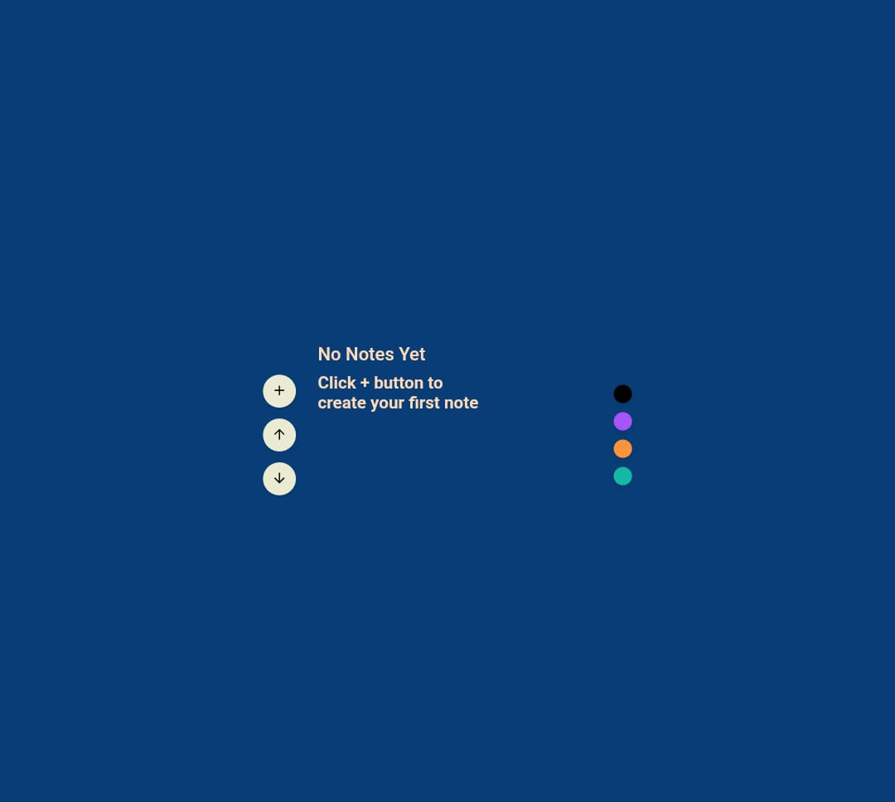
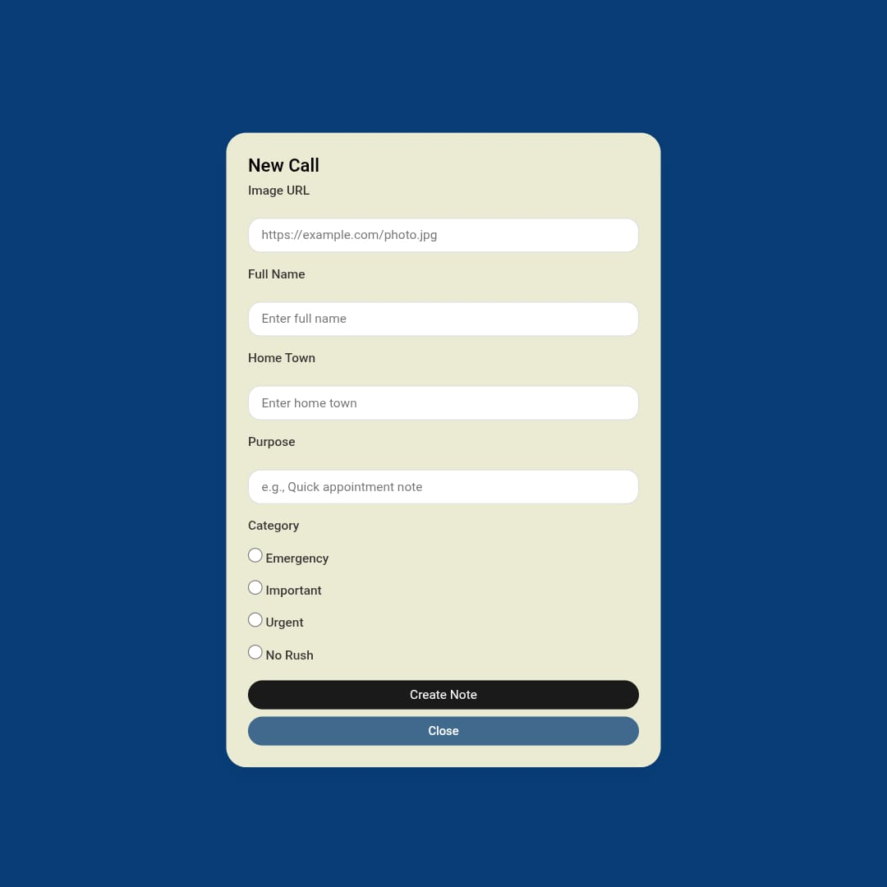
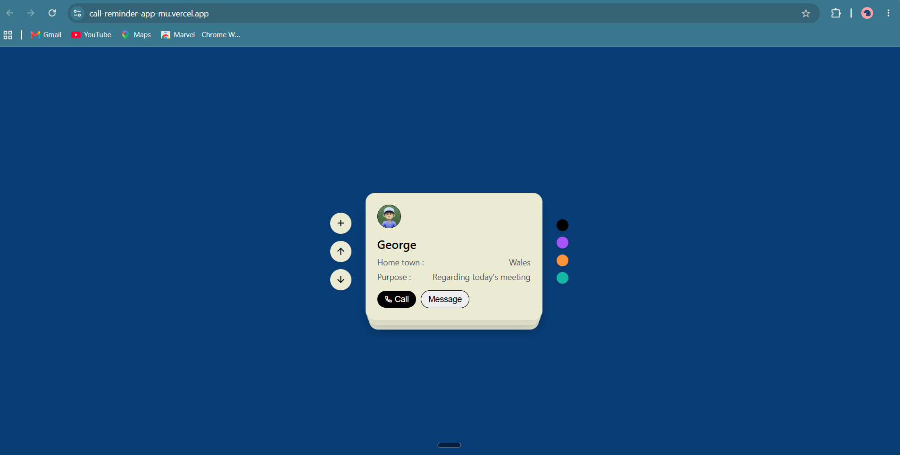
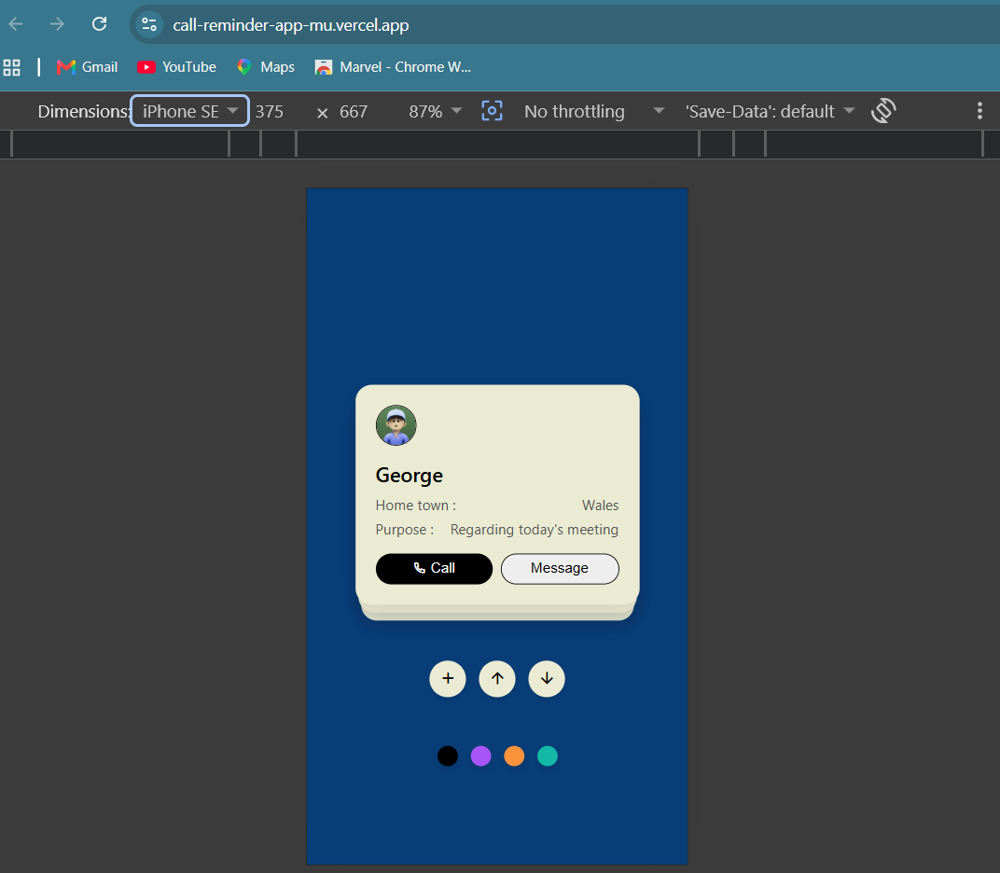

# Call Reminder App

A clean and interactive Call Reminder App built using HTML, CSS, and Vanilla JavaScript. Users can create personalized reminder cards, store them locally, and navigate through them using a stacked card interface.

## Live Demo

🔗 https://call-reminder-app-mu.vercel.app

---

# Project Screenshots

### Empty Page


---

### Home Page



---

### Add Reminder Form



---

### Reminder Cards



---

### Mobile View



## Features

- Create personalized call reminder cards.
- Store notes permanently using Local Storage.
- Interactive stacked card UI.
- Navigate between cards using Up and Down buttons.
- Image URL support with automatic fallback image handling.
- Basic form validation for all required fields.
- Empty state UI when no notes are available.
- Responsive design for mobile devices.

## Built With

- HTML5
- CSS3
- JavaScript (ES6)
- DOM Manipulation
- Local Storage API
- Git & GitHub
- Vercel

## Project Preview

Each card displays:

- Profile Image
- Full Name
- Home Town
- Purpose of the Reminder
- Call and Message Buttons
- Category Selection (Normal / Emergency etc.)

## How It Works

1. Click the "+" button to create a new reminder.
2. Fill in all the required details.
3. Submit the form to generate a reminder card.
4. Your data is automatically stored in Local Storage.
5. Navigate through your reminders using the Up and Down buttons.
6. Refresh the page anytime — your reminders will still be available.

## Responsive Design

The application is optimized for:

- Desktop Devices
- Tablets
- Mobile Phones

## Future Improvements

- Delete Reminder functionality.
- Search and Filter support.
- Dark Mode support.
- Theme customization.

## Installation

```bash
git clone https://github.com/Tjshar/Call-Reminder-App
```

Move to the project folder:

```bash
cd Call-Reminder-App
```

Simply open:

```bash
index.html
```

No additional setup is required.

## Author

**Tushar Chaurasiya**

---

Made with Vanilla JavaScript and lots of debugging sessions :)